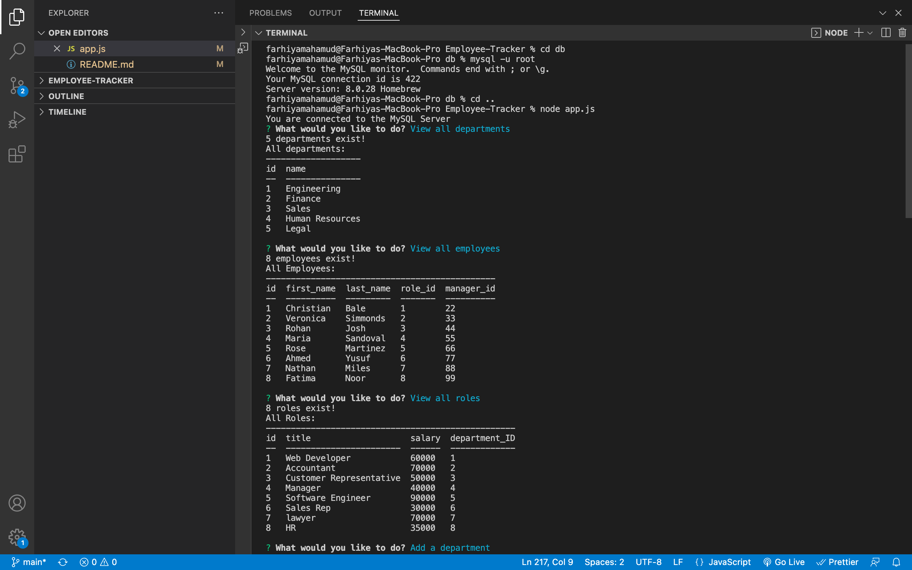
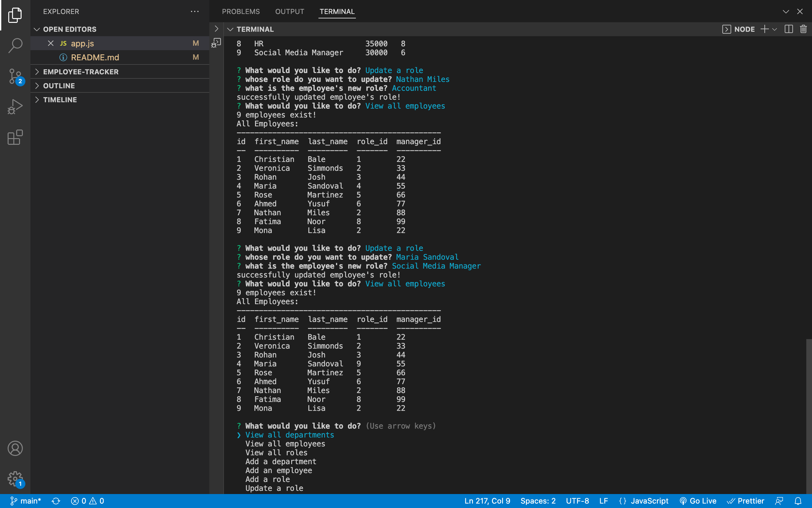
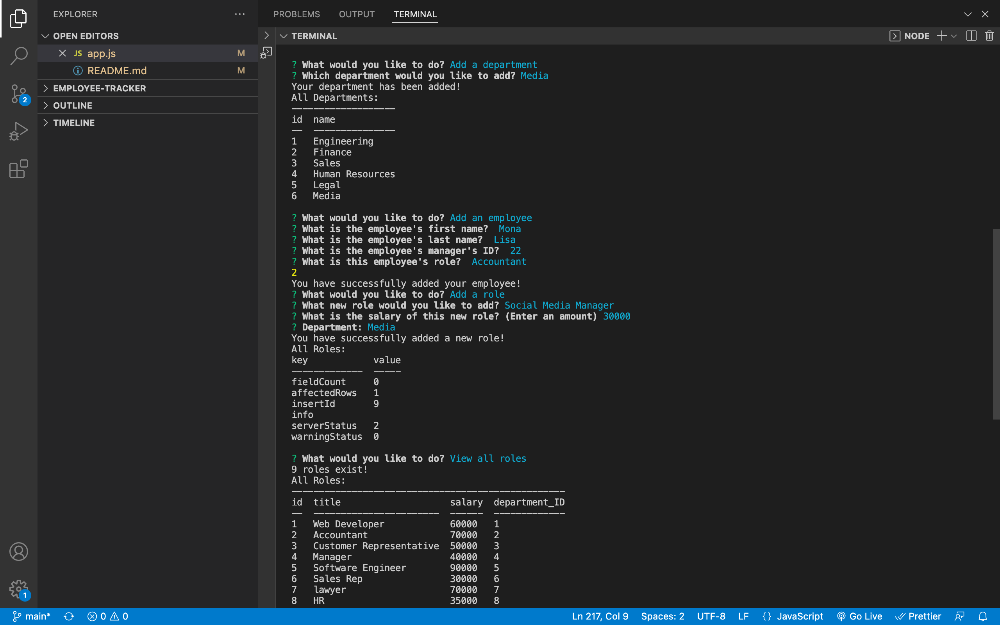

# Employee-Tracker

# Why did I build this project?

Building a command-line application from scratch to manage a company's employee database, using Node.js, Inquirer, and MySQL. This content managment system would allow for non-developers to easily view and interact with information stored in the database.

This application will also give me the opportunity and experience to build and develop my skills using node js, mysql and inquirer.

# What have I achieved so far?

1. I have met all the acceptance criterias below

# Why I would like to add in the future?

1. I would like to try and add some additional functionality to my application, such as the ability to do the following:

- Update employee managers.

- View employees by manager.

- View employees by department.

- Delete departments, roles, and employees.

- View the total utilized budget of a department&mdash;in other words, the combined salaries of all employees in that department.

## User Story

```md
AS A business owner
I WANT to be able to view and manage the departments, roles, and employees in my company
SO THAT I can organize and plan my business
```

## Acceptance Criteria

```md
GIVEN a command-line application that accepts user input
WHEN I start the application
THEN I am presented with the following options: view all departments, view all roles, view all employees, add a department, add a role, add an employee, and update an employee role
WHEN I choose to view all departments
THEN I am presented with a formatted table showing department names and department ids
WHEN I choose to view all roles

THEN I am presented with the job title, role id, the department that role belongs to, and the salary for that role
WHEN I choose to view all employees
THEN I am presented with a formatted table showing employee data, including employee ids, first names, last names, job titles, departments, salaries, and managers that the employees report to
WHEN I choose to add a department
THEN I am prompted to enter the name of the department and that department is added to the database
WHEN I choose to add a role
THEN I am prompted to enter the name, salary, and department for the role and that role is added to the database
WHEN I choose to add an emplthe employee’s first name, last name, role, and manager, and that employee is added to the database
WHEN I choose to update an employee roleoyee
THEN I am prompted to enter
THEN I am prompted to select an employee to update and their new role and this information is updated in the database
```

# To access this project the following links are provided:

To access Github Repository

1. https://github.com/Farhiya1/Employee-Tracker.git

To access demo of application

2. https://drive.google.com/file/d/1y3Msxpu8xHmzoxezSEVpCWLEFoD8y3lW/view?usp=sharing

# Screenshot of deployed application)

1. Screenshot displaying Existing Info in database



2. Screenshots of added employee and updated role of an existing employee



3. Screenshots of added new department



# References

1. https://www.w3schools.com/nodejs/nodejs_mysql.asp
2. https://developer.mozilla.org/en-US/docs/Web/API/console/table
3. https://www.npmjs.com/package/inquirer
4. https://www.mysql.com/
5. https://www.digitalocean.com/community/tutorials/nodejs-interactive-command-line-prompts
6. https://www.w3schools.com/js/js_switch.asp
